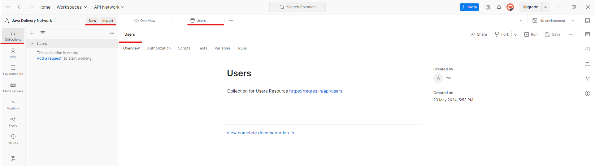

# Sesión 1: 
    Configurando ambiente

## Objetivo:
    Configurar el workspace para agrupar varias peticiones a un servicio web. 

## Recursos necesarios:

    - Herramienta para realizar peticiones por http. Se sugiere realizarlo con Postman. 
    - Servicio Rest. 

        Servicio: https://reqres.in/ 
        Documentacion: https://reqres.in/api-docs/ 

## Primeros Pasos con Postman:

    1. Abrir Postman y crear una nueva colección para organizar las peticiones.

  
    
    2. Crear una nueva solicitud (Request) y seleccionar el método GET.

    

    3. Usar la URL https://reqres.in/api/users
    4. Hacer clic en "Send" y observar la respuesta en formato JSON.

  

    

## Análisis de la Respuesta:

    Explicar los componentes de una respuesta HTTP: código de estado, cabeceras y cuerpo.
    Mostrar cómo interpretar el código de estado (por ejemplo, 200 OK, 404 Not Found).
