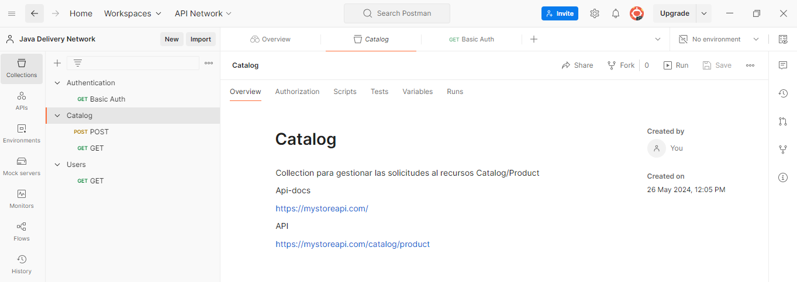
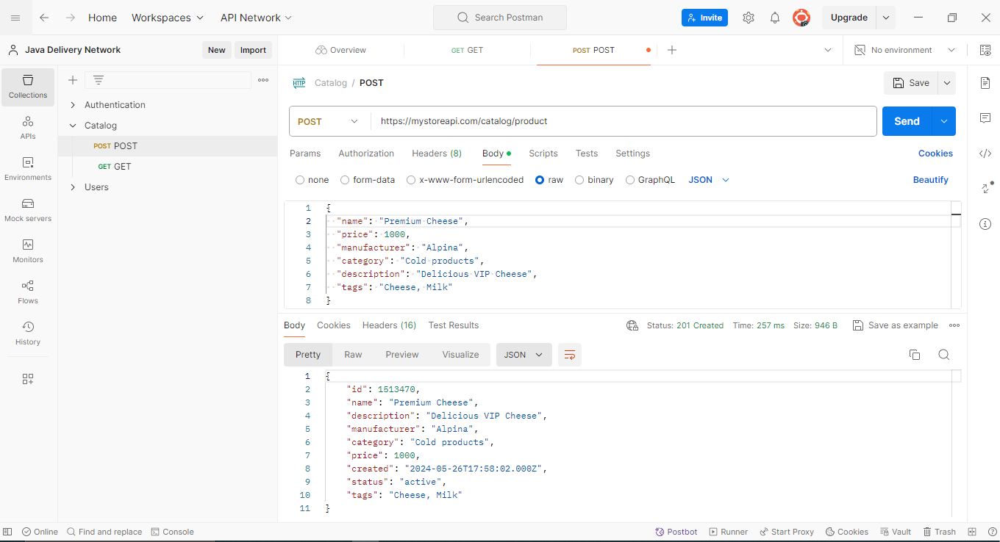
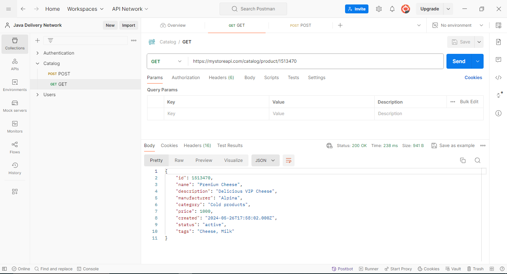

# Sesión 3. Introducción a las Peticiones HTTP POST

## Objetivo:
    Aprender a realizar peticiones HTTP POST y validar los mensajes de creacion del recursos. 

## Recursos necesarios:

    -  Herramienta para realizar peticiones por http. Se sugiere realizarlo con Postman.
    - Servicio Rest. 

        Servicio: https://mystoreapi.com/catalog/product 
        Documentacion: https://mystoreapi.com 

## Primeros Pasos con Postman:

    1. Abrir Postman y crear una nueva colección para organizar las peticiones. Con el nombre Catalog. 

  

    2. Crear una nueva solicitud (Request) y seleccionar el método POST.
    3. Usar la URL https://mystoreapi.com/catalog/product 

    4. En el panel Body, seleccionar el check box Raw y pegar el siguiente json modificando sus valores. 

### Request 

        {
            "name": "Cheese",
            "price": 1000,
            "manufacturer": "Alpina",
            "category": "Cold products",
            "description": "Delicious VIP Cheese",
            "tags": "Cheese, Milk"
        }

    5. Hacer clic en "Send" y observar la respuesta en formato JSON.

  
  

    6. Consultar el registro creado usando el metodo GET. Para esto, se crea una nueva solicitud (Request) y seleccionar el método GET.
    7. Usar la URL https://mystoreapi.com/catalog/product/${ID_CREADO}

## Análisis de la Respuesta:

    Explicar los componentes de una respuesta HTTP: código de estado, cabeceras y cuerpo.
    Mostrar cómo interpretar el código de estado (por ejemplo, 201 Created, 404 Not Found).
