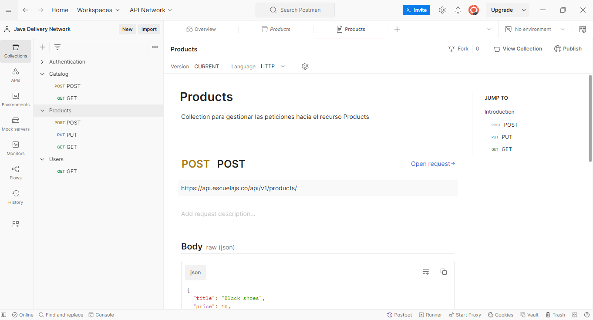

# Sesión 4. Introducción a las Peticiones HTTP PUT

## Objetivo:
    Aprender a realizar peticiones HTTP PUT y validar los mensajes de creacion del recursos. 

## Recursos necesarios:

    -  Herramienta para realizar peticiones por http. Se sugiere realizarlo con Postman.
    - Servicio Rest. 

        Servicio: https://api.escuelajs.co/api/v1/products 
        Documentacion: https://fakeapi.platzi.com/ 

## Primeros Pasos con Postman:

    1. Abrir Postman y crear una nueva colección para organizar las peticiones. Con el nombre Products. 

  

    2. Crear una nueva solicitud (Request) y seleccionar el método POST.
    3. Usar la URL https://api.escuelajs.co/api/v1/products  

    4. En el panel Body, seleccionar el check box Raw y pegar el siguiente json modificando sus valores. 

### Request 

        {
            "title": "Black shoes",
            "price": 10,
            "description": "Amazing Black shoes for her and him",
            "categoryId": 1,
            "images": ["https://placeimg.com/640/480/any"]
        }

    5. Hacer clic en "Send" y observar la respuesta en formato JSON.

  
  

    6. Consultar el registro creado usando el metodo GET. Para esto, se crea una nueva solicitud (Request) y seleccionar el método GET.
    7. Usar la URL https://api.escuelajs.co/api/v1/products/${ID_CREADO}

    8. Para actualizar el registro creado anteriormente, se crea una nueva solicitud y se selecciona el metodo PUT. 
    9. Usar la URL https://api.escuelajs.co/api/v1/products/${ID_CREADO}
    10. Se modifica el cuerpo del mensaje y se envia la peticion. 

### Request 

        {
            "title": "Black shoes",
            "price": 120,
            "description": "Amazing Black shoes for her and him",
            "categoryId": 1,
            "images": ["https://placeimg.com/640/480/any"]
        }

    11. Consultar el registro editado, se reutiliza la solicitud  usando el metodo GET con la URL https://api.escuelajs.co/api/v1/products/${ID_CREADO}

## Análisis de la Respuesta:

    Explicar los componentes de una respuesta HTTP: código de estado, cabeceras y cuerpo.
    Mostrar cómo interpretar el código de estado (por ejemplo, 201 Created, 404 Not Found).
