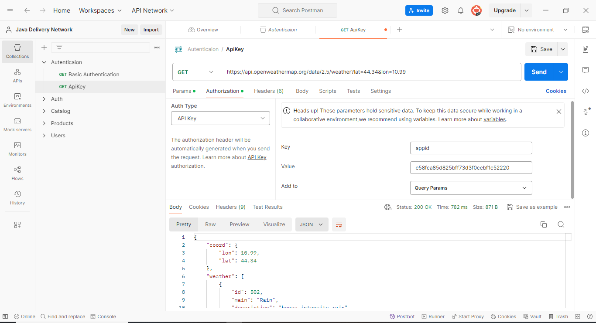

# Sesión 5: 
    Autenticación usando API KEY. 

## Objetivo:
    Conocer la forma de autenticación por API KEY para realizar llamados por API

## Recursos necesarios:

    - Herramienta para realizar peticiones por http. Se sugiere realizarlo con Postman. 
    - Servicio Rest. 

        Servicio: https://api.openweathermap.org/data/2.5/weather?lat=44.34&lon=10.99
        Documentacion: https://openweathermap.org/current

## Primeros Pasos con Postman:
    
    1. Crear una nueva solicitud (Request) y seleccionar el método GET.
    2. Usar la URL https://api.openweathermap.org/data/2.5/weather?lat=44.34&lon=10.99
    3. Se pueden modificar los parametros lat, lon 
    4. En la pestana de autorización, seleccionar API Key 
    5. Colocar en el valor de Key = "appid" 
    6. Colocar en el valor de Value = e58fca85d825bff73d3f0cebf1c52220
    7. Seleccionar en Add to = Query Params

  

    

## Análisis de la Respuesta:

    Explicar la respuesta HTTP obtenida. Modifique los parametros user/password y verifique la respuesta generada. 
    
