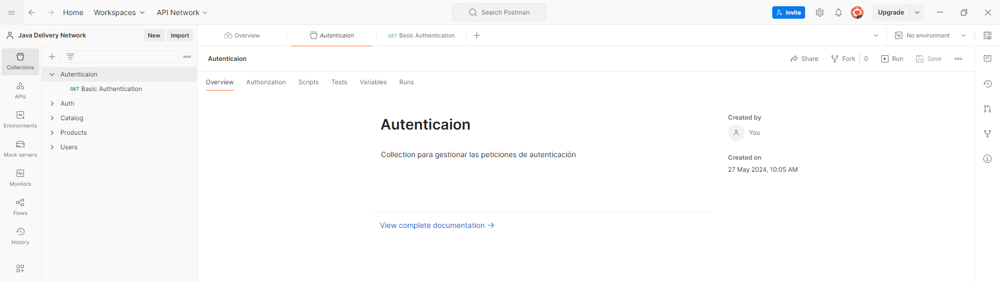
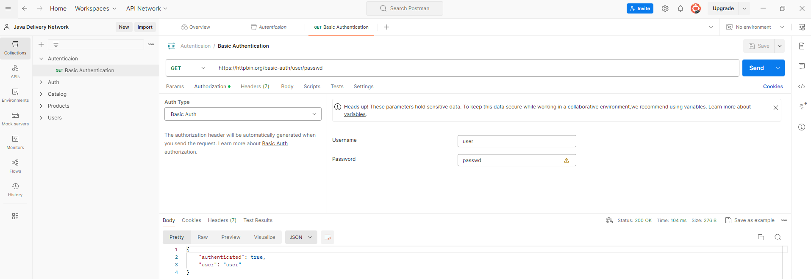

# Sesión 5: 
    Autenticación 

## Objetivo:
    Conocer la forma de autenticación por Basic Authentication para realizar llamados por API

## Recursos necesarios:

    - Herramienta para realizar peticiones por http. Se sugiere realizarlo con Postman. 
    - Servicio Rest. 

        Servicio: https://httpbin.org/basic-auth/user/passwd
        Documentacion: 

## Primeros Pasos con Postman:

    1. Abrir Postman y crear una nueva colección para organizar las peticiones con el nombre de Autenticación.

  
    
    2. Crear una nueva solicitud (Request) y seleccionar el método GET.
    3. Usar la URL https://httpbin.org/basic-auth/user/passwd
    4. En la pestaña de autorización, seleccionar "Basic auth" y digitar en username "user", y password "passwd"
    4. Guardar la solicitud y hacer clic en "Send" y observar la respuesta en formato JSON.

  

    

## Análisis de la Respuesta:

    Explicar la respuesta HTTP obtenida. Modifique los parametros user/password y verifique la respuesta generada. 
    
