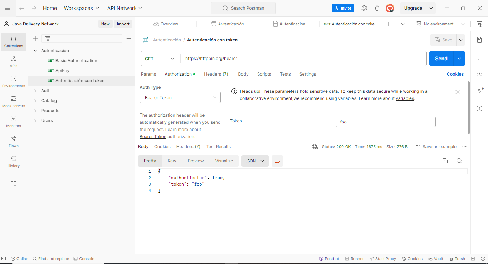

# Sesión 5: 
    Autenticación usando Bearer Token. 

## Objetivo:
    Conocer la forma de autenticación por Bearer Token para realizar llamados por API

## Recursos necesarios:

    - Herramienta para realizar peticiones por http. Se sugiere realizarlo con Postman. 
    - Servicio Rest. 

        Servicio: https://httpbin.org/bearer
        Documentacion: 

## Primeros Pasos con Postman:
    
    1. Crear una nueva solicitud (Request) y seleccionar el método GET.
    2. Usar la URL https://httpbin.org/bearer
    3. En la pestana de autorización, seleccionar Bearer Token
    4. Colocar en token = "foo" 
    5. Guardar y enviar la petición. 

  

    

## Análisis de la Respuesta:

    Explicar la respuesta HTTP obtenida. Modifique los parametros user/password y verifique la respuesta generada. 
    
